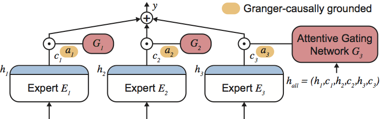

# MoE-based-FL-for-secure-STLF


### To Dos
* `Github`: Improve the readme
* `Struktur`: Github
* `Firest small`: Prediction

<br />

### Commands
Environment [Tutorial](https://medium.com/@dipan.saha/managing-git-repositories-with-vscode-setting-up-a-virtual-environment-62980b9e8106 )

Create Environment
```bash
.venv\Scripts\activate.ps1 
```
Deaktivate Environment
```bash
deactivate
```
Requirements
```bash
pip freeze > requirements.txt
```

<br />


  <center>
    
  </center>

<br />

> **Abstract**: Electricity load forecasting is an essential task within smart grids to assist demand and supply balance. While advanced deep learning models require large amounts of high-resolution data for accurate short-term load predictions, fine-grained load profiles can expose users' electricity consumption behaviors, which raises privacy and security concerns. One solution to improve data privacy is federated learning, where models are trained locally on private data, and only the trained model parameters are merged and updated on a global server. However, the heterogeneous load data requires prediction models that allow for high capacity and variance in predictions. Mixture of Experts models are a promisiong solution to solve this problem, as they combine multiple specialzed expert models based on a gating mechanism to increase model capacity. Therefore, this paper presents a novel Mixture of Experts based deep learning approach with federated learning for short-term electricity load prediction. To evaluate our results, we benchmark our federated learning architecture against central and local learning and compare the performance of our model to long short-term memory models and convolutional neural networks. Our simulations are based on a dataset from a German university campus and show that Mixture of Expert based forecasting is a promising alternative to state-of-the-art models within federated learning. <br />
[FULL PAPER](https://www.iccep.net/upload/SSEMSG171.pdf)

<br />

### Table of Contents
- Install and Run the project
- How to use the project

<br />

### Install and Run the project 
Clone the github repository and install the requirements file. 

<br />

### How to use the project 
This prouject provides: 
- Dataset
- Different forecasting MoE models
- Federated Learning architecture 
