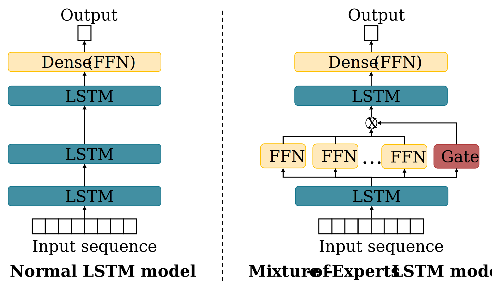

# Mixture-of-Experts based Federated Learning for secure short-term load forecasting

> **Abstract:**
> *Accurate load forecasting is essential for the reliable planning and operation of smart grids, to improve energy storage optimization, or to enable demand response programs. As load forecasting often involves heterogeneous and complex data patterns with high variability, precise predictions are still challenging. Here, models with enhanced adaptability and generalizability are crucial, making Mixture-of-Experts (MoE) a promising solution. An MoE layer combines the predictions of multiple specialized sub-models, known as experts, using a gating mechanism to dynamically select and weight the experts' outputs based on the input sequence. Existing deep learning models can integrate this generic layer into their architecture to learn and handle complex patterns in data adaptively. In this paper, we adopt the MoE concept to dense and bidirectional long short-term memory models for load forecasting, using soft- and top-k gating. As our benchmark, we consider stateof-the-art bidirectional long short-term memory models, convolutional neural networks, residual neural networks, and transformer models. Further, we implement both local and federated learning architectures. In federated learning, models are trained locally on private data, and only the trained model parameters are merged and updated on a global server to improve accuracy and data privacy. Utilizing the Ausgrid dataset, we demonstrate that including an MoE layer into existing model architectures can increase accuracy by up to 13 % while decreasing the total training time by 33 %. Additionally, implementing the MoE model within an FL architecture can improve model accuracy by a further 4% compared to local learning.*
 

### Project structure
This repsoitory consists of the following parts: 
- **data** folder: Here are all datasets and scripts to collect the datasets, preprocess them, performe feature engineering and create the final dataset used for the forecasting task.
- **evaluations** folder: Here are all the evaluation results stored
- **images** folder: Here are all figures and plots stored and the script to create them
- **models** folder: Here the model weights are stored
- **src** folder: Here the main scripts are stored for the forecasting baseline, local learning, federated learning and evaluation
  - **utils** folder: Here helper classes for data handling, model generation, and model handling are stored

### Install and Run the project 
